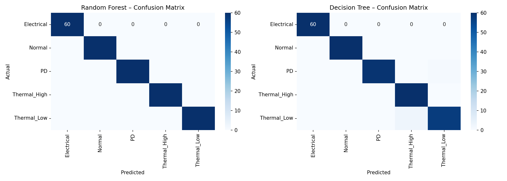
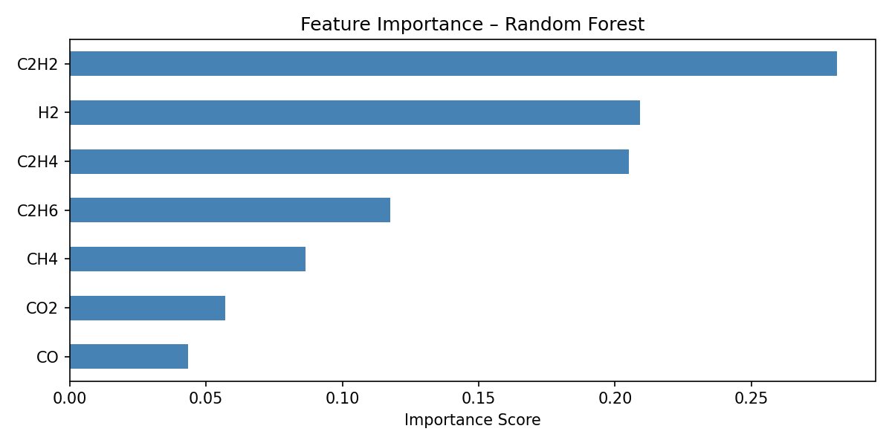

#  Transformer Fault Detection using ML

##  Overview
This project detects faults in power transformers using Dissolved Gas Analysis (DGA) data and Machine Learning.

##  Features
- Classification of faults (thermal, electrical, partial discharge)
- Feature importance analysis
- Confusion matrix evaluation

##  Tech Stack
- Python
- Pandas, NumPy
- scikit-learn
- Matplotlib

##  Dataset
- DGA (Dissolved Gas Analysis) dataset used for transformer fault classification  
- Contains gas concentration features for detecting fault types (thermal, electrical, partial discharge)  
- File included: [dga_dataset.csv](dga_dataset.csv)

##  Output
- Fault classification results
- Confusion matrix visualization
- Feature importance plot

## 📷 Sample Output

